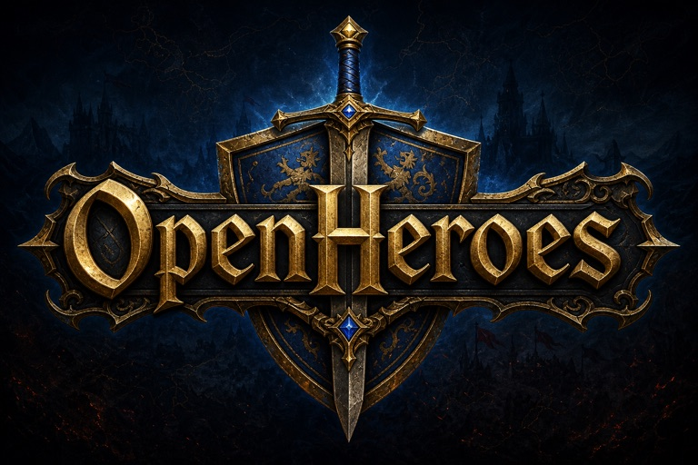

<p align="center">
  
</p>

# Open Heroes

A browser-based, single-player clone of a classic turn-based strategy game: heroes explore
an adventure map, collect resources, capture mines and towns, build up towns, recruit
creature armies, learn spells, and fight tactical hex-grid battles against AI opponents
(plus local hotseat). All art is original; only game *mechanics* are cloned.

Pure TypeScript, no UI framework, no runtime dependencies beyond `zod`.

## Running

```sh
npm install
npx playwright install chromium   # once, for e2e tests
npm run dev                       # dev server (Vite) — open the printed URL
npm run build                     # typecheck + production build (dist/)
npm run preview                   # serve the production build
```

Dev/e2e boot shortcuts: `?map=<id>&seed=<n>` URL params skip the menu and start a game
directly (e.g. `/?map=tiny&seed=42`). Plain `/` boots the main menu.

## Controls & mobile support

The UI is fully responsive and playable on phones (390px portrait and up).

- **Desktop:** click to select, click destination twice to move; pan with middle-button
  drag, arrow keys, or edge scroll; zoom with the mouse wheel or `+`/`-` (0.5×–2×);
  right-click a tile for info.
- **Touch:** one-finger drag pans the map, pinch zooms, tap selects (same two-tap move
  confirmation), long-press shows tile info.
- On narrow screens (≤768px) the sidebar becomes a slide-in drawer behind a ☰ button;
  End Turn and Next Hero stay reachable in the bottom bar, and the combat battlefield
  scales to fit the viewport.

## Testing

```sh
npm test                # unit tests (Vitest)
npm run test:watch      # unit tests in watch mode
npm run test:e2e        # browser tests (Playwright)
npm run test:balance    # slow AI-vs-AI balance simulation suite
npm run check           # tsc + eslint + unit tests — the pre-commit gate
npm test -- --coverage  # coverage report (target: >=80% lines in src/core/)
```

## Architecture

```
src/
  core/        pure game logic — no DOM, no rendering, fully deterministic
    state.ts        GameState types
    rng.ts          seeded PRNG (mulberry32) — ALL randomness flows through here
    commands.ts     Command types + dispatcher (reducer pattern)
    turn.ts         day/week/month cycle, income, growth
    hero.ts         stats, experience, leveling, skills, army/artifact ops
    movement.ts     A* pathfinding, movement points, terrain costs
    objects.ts      adventure-map object interactions
    town.ts         building, recruiting, mage guild, marketplace
    combat/         battle engine (grid, damage, abilities, siege, resolve)
    magic.ts        mana, spellbook, spell effects
    fog.ts          fog of war / shroud
    ai/             AI players (adventure, economy, combat)
    victory.ts      win/loss evaluation
    replay.ts       scripted command runner for golden tests
  data/        JSON game content + zod schemas + loader (index.ts)
    factions/       castle.json, rampart.json, necropolis.json
    creatures.json  spells.json  artifacts.json  buildings.json
    objects.json    terrain.json  heroes.json  skills.json
  maps/        map zod schema, ASCII map DSL compiler, sample maps
  assets/      themed art — woodcut SVG sprites (terrain/, roads, creatures/, heroes/)
  render/      Canvas 2D renderers (adventure, combat), sprite atlas + sprite
               painter for themed art, token painter as the flat-color fallback
  ui/          DOM overlay screens (town, hero, combat, dialogs, HUD)
  app/         game shell: main menu, screen router, save/load, input, shortcuts
```

### Key design decisions

1. **Command/reducer core.** All gameplay is `dispatch(state, command) -> { state, events }`.
   The UI and the AI both emit commands; the core does not know who is playing. This gives
   unit testing, replays, save/load, and hotseat for free.
2. **Determinism.** One seeded PRNG (`mulberry32`) lives inside `GameState` (`rngState`);
   same seed + same command sequence produces an identical game. The core never calls
   `Math.random()` or reads the clock. Golden replay tests in `src/core/replay.test.ts`
   enforce this.
3. **Data-driven content.** Creatures, buildings, spells, artifacts, factions, and map
   objects are JSON validated by zod schemas at load time. Code references content only by
   string id; the loader (`src/data/index.ts`) cross-validates references (dangling ids,
   prereq cycles). Adding a faction means adding JSON, not code.
4. **Canvas 2D + DOM overlay.** Tile map and battlefield are drawn on `<canvas>`;
   menus, town screen, and dialogs are plain DOM — easy for text-heavy UI and
   e2e-testable via selectors.
5. **Painter interface + themed art.** All canvas drawing goes through the `Painter`
   interface. Adventure terrain, roads, fog, creature seals, and the horseman hero
   marker — plus the combat stacks — are drawn from the woodcut SVG theme
   (`src/assets/themes/woodcut/`, rasterized at startup into a sprite atlas, shared by
   both screens). `TokenPainter` is the flat-color *fallback*: un-arted creatures
   (initials on the seal), any sprite still loading or missing, and the remaining
   plain tokens. The minimap bypasses the painter entirely (flat terrain colors).

### Known limitations

- **AI ignores fog of war.** The adventure AI (`src/core/ai/adventureAI.ts`) evaluates
  the full game state, so it "cheat-sees" through the shroud. Accepted MVP deviation per
  the plan spec (section 8.4); per-player visibility filtering for the AI is future work.

## Adding a faction (data only)

The engine is fully data-driven — a new faction requires zero engine code. Use
`src/data/factions/castle.json` as the reference. Steps:

1. **Allow the faction id.** Add the id to the faction id enum in `src/data/schema.ts`
   (the one place the list of factions is declared).
2. **Creatures** — in `src/data/creatures.json`, add 14 creatures (7 tiers, base +
   upgrade), each with `faction` set to the new id and the upgrade carrying
   `upgradeOf: "<base id>"`. Stats: attack, defense, damage min/max, hp, speed, growth,
   cost, and ability flags (`ranged`, `flying`, `wide`, `undead`, named specials — see
   existing entries; specials are implemented as data-selected hooks in
   `src/core/combat/abilities.ts`, so reuse existing special ids).
3. **Faction file** — create `src/data/factions/<id>.json` with:
   - `id`, `name`, `color` (hex), `alignment`
   - `creatures`: the 7 tier entries `{ tier, base, upgrade }`
   - `dwellings`: 14 dwelling buildings (7 base + 7 upgrades with `upgradeOf`), each with
     `cost`, `prereqs` (tier N requires `fort` + tier N-1 dwelling), and `creature`
   - `specialBuildings`: faction specials (`kind: "special"`)
   - `heroClasses`: exactly 2 class ids (defined in step 4)
   - `spellPool`: spell ids the mage guild can roll
   - `siloResource`: which rare resource the Resource Silo produces
   - `maxGuildLevel`: 1–5
4. **Hero classes and heroes** — in `src/data/heroes.json`, add 2 classes (start stats,
   early/late level-up stat chances, `hasSpellbook`, `skillWeights` for the level-up skill
   pool) and 4+ named hero templates per class (`startSkills`, `startArmy`, optional
   `startSpell`).
5. **Register the file** — import the new faction JSON in `src/data/index.ts` and add it
   to the factions list (the only code edit, and it is one import line).
6. **Validate** — `npm test` runs the schema + cross-reference checks in
   `src/data/data.test.ts`; it will list every dangling id or broken prereq edge. Update
   the data-shape assertions there (creature/dwelling counts) to include the new faction.

Once data validates, the faction is selectable in new-game setup, buildable, recruitable,
and playable by the AI with no further changes.

## Map DSL guide

Maps are authored as TypeScript `MapSource` objects (see `src/maps/dsl.ts`) and compiled
to validated map JSON by `compileMap(source, data)`. Samples:
`src/maps/tutorial-valley.dsl.ts`, `src/maps/contested-river.dsl.ts`, and the test
fixture `src/maps/fixtures/tiny.dsl.ts`.

A map source has:

- `id`, `name`
- `terrain`: a square char grid (array of equal-length strings), one char per tile.
  Chars come from `src/data/terrain.json`:

  | char | terrain | move cost |
  |---|---|---|
  | `g` | grass | 100 |
  | `d` | dirt | 100 |
  | `s` | sand | 150 |
  | `n` | snow | 150 |
  | `S` | swamp | 175 |
  | `r` | rough | 125 |
  | `l` | lava | 100 |
  | `w` | water | impassable |

- `roads` (optional): same-size grid layered over terrain; `.` = no road,
  `D` dirt road (75), `G` gravel (65), `C` cobblestone (50). Road cost overrides terrain.
- `players`: `{ color, faction, isHuman, startTownAt: [x, y], startHero }` — each player
  needs a town object at `startTownAt` owned by their color, and a start hero of their
  faction.
- `objects`: list of `{ type, at: [x, y], ... }`. `at` is the trigger tile. Types and
  their extra fields (validated by the compiler): `town` (`owner`), `mine` (`subtype`,
  e.g. `sawmill`), `resource` (`subtype`, `amount`), `monster` (`creature`, `count`),
  `dwelling` (`creature`), `artifact` (`artifact`), `sign` (`message`), `monolith`
  (`pairId` — exactly 2 per pair), `prison` (`hero`), plus `treasure_chest`, wells,
  and the rest of the catalog in `src/data/objects.json`. Any object may carry a
  `guard: { creature, count }`.
- `victory` / `loss` (optional): default `{ type: "defeatAll" }` / `{ type: "loseAll" }`.

Towns occupy a 3x2 footprint (trigger tile = bottom-center); all other objects are 1 tile.
The compiler reports every problem at once with row/col coordinates: unknown chars, ragged
grids, out-of-bounds or overlapping footprints, roads/objects on impassable terrain,
dangling content ids, unowned start towns, unpaired monoliths.

Register a new map by adding its source to the `sources` list in `src/maps/index.ts`;
it then appears in the new-game map list and is covered by the compile-all test in
`src/maps/maps.test.ts`.

## Themes & sprites

Adventure-map art is theme-based: a theme is a directory of id-keyed SVG files under
`src/assets/themes/<name>/` (currently `woodcut`). Filenames map to sprite keys:

- `terrain/<terrainId>.svg` → sprite key `terrain/<id>` (e.g. `terrain/grass.svg`)
- `terrain/road.<roadId>.svg` → sprite key `road/<id>` (e.g. `terrain/road.dirt_road.svg`)
- `creatures/<creatureId>.svg` → sprite key `creature/<id>` (creature emblem art, e.g.
  `creatures/gold_dragon.svg`)
- `heroes/horseman.svg` → sprite key `hero/horseman` (the mounted-hero marker art)

SVGs are 64×64 viewBox, loaded as raw text and rasterized once at startup into an
in-memory atlas (`src/render/spriteAtlas.ts`). The fallback chain is theme sprite → `TokenPainter`
flat color, so a missing or still-loading sprite never breaks rendering (and the minimap
always uses flat terrain colors).

**Static art vs. procedural furniture.** A creature emblem and the horseman are *static*
shared atlas bitmaps (one per id, identical for every owner/stack). The per-instance
"furniture" around them is drawn *procedurally* by `SpritePainter`, not baked into the
SVG: a creature emblem sits on a procedural **seal** (parchment disc, double ink ring,
gold tier pips, and a player-color banner notch), and the horseman's swallow-tail banner
gets its player-color fill + hero initial drawn on top. This keeps the atlas static while
ownership, tier, and the hero letter stay dynamic. The woodcut theme ships bespoke emblems
for all 51 creatures; the **initials centered on the seal** fallback only stands in before
the bitmap loads, when art is missing, or for a future theme lacking emblems — so every
creature still gets the seal look regardless.

A coverage test in `src/assets/themes/woodcut/index.test.ts` asserts every terrain, road,
and creature id has a sprite and every present `creature/*` key maps to a real creature id
— adding content means adding matching art.

## License

[MIT](LICENSE) — covers the code, the game data, and the original artwork in
`assets/` and `public/` (logo and icon). The game reimplements *mechanics* of a classic
strategy game from scratch; it contains no assets, text, or code from the original.

## Game rules reference

The full game specification (formulas, data tables, screens) lives in
`docs/plans/completed/20260611-heroes3-browser-clone.md`. Quick pointers:

- Damage formula: `src/core/combat/damage.ts` (attack/defense multiplier, caps 4.0/0.3)
- Movement costs and MP formula: `src/core/movement.ts`, `src/core/hero.ts`
- Income/growth cycle: `src/core/turn.ts`
- Save format and migrations: `src/core/serialize.ts`, `src/app/saveload.ts`
